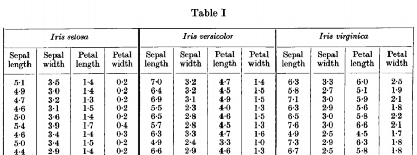
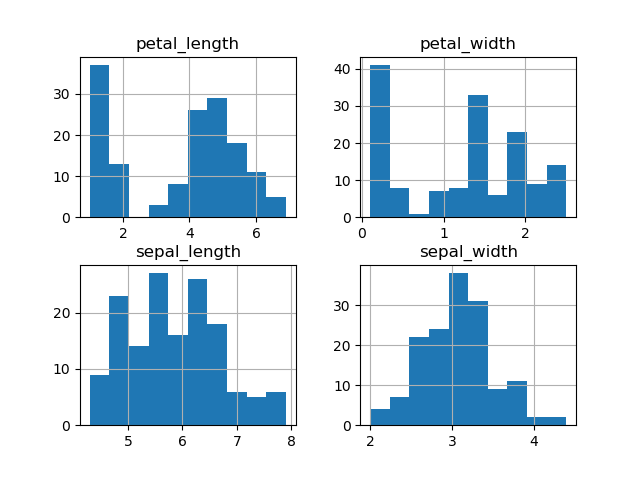
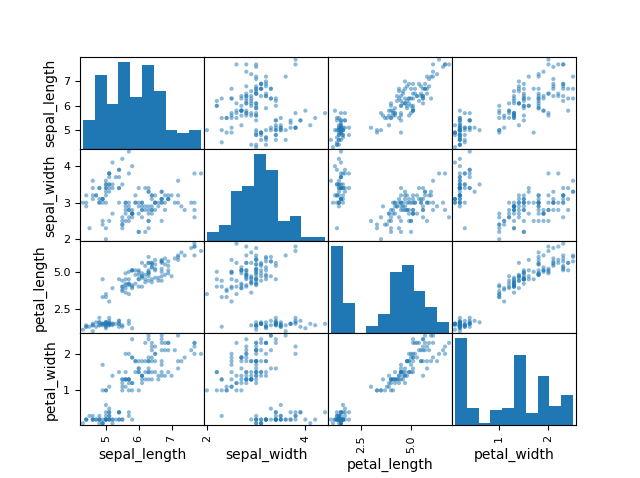
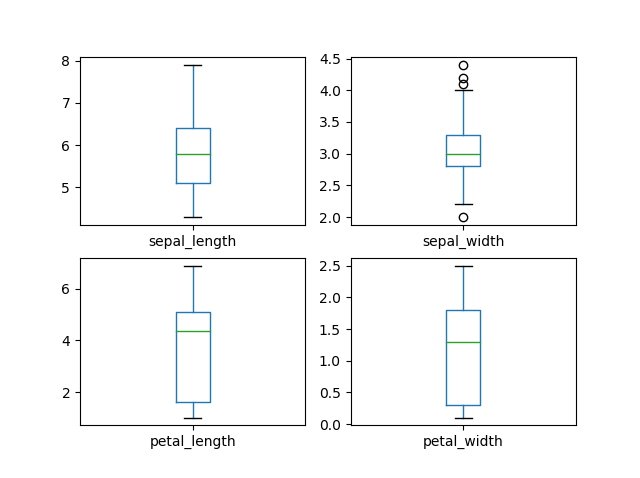
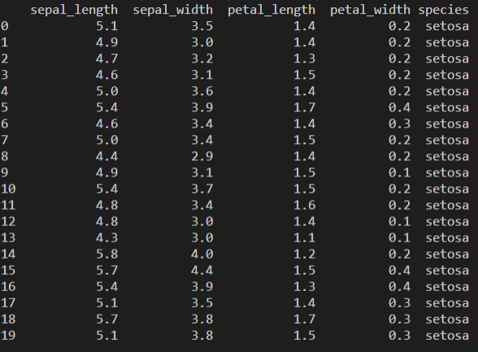
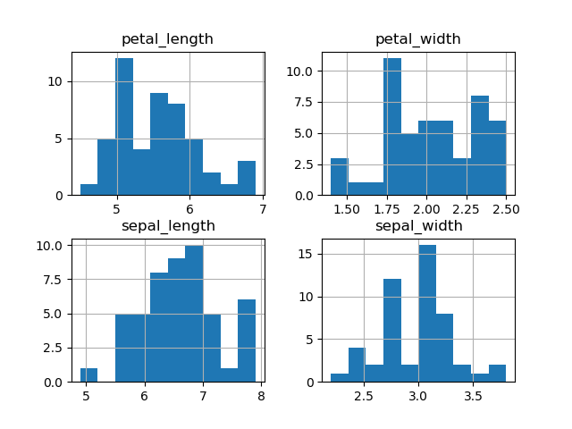
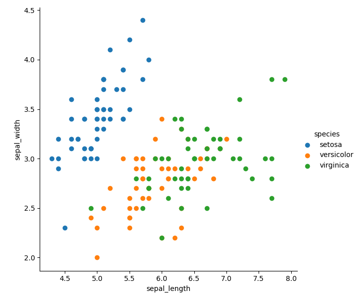

# pands-project
My GMIT Programming and Scripting Project 2020

## Introduction
This repository contains my research of the well known [Fisher’s Iris data set](https://en.wikipedia.org/wiki/Iris_flower_data_set) with written documentation and code in Python for my project. 
I downloaded the [irish data set](IrisDataSet.csv) from [github](https://raw.githubusercontent.com/uiuc-cse/data-fa14/gh-pages/data/iris.csv).

## Problem statement
"This project concerns the well-known Fisher’s Iris data set. You must research the data set and write documentation and code (in Python) to investigate it. An online search for information on the data set will convince you that many people have investigated it previously. You are expected to be able to break this project into several smaller tasks that are easier to solve, and to plug these together after they have been completed. You might do that for this project as follows: 
> 1. Research the data set online and write a summary about it in your README. 
> 2. Download the data set and add it to your repository. 
> 3. Write a program called analysis.py that: 
>
> • outputs a summary of each variable to a single text file, 
> • saves a histogram of each variable to png files, and 
> • outputs a scatter plot of each pair of variables. "

### Program solution: [analysis.py](https://github.com/AineNicD/pands-project/blob/master/analysis.py)

## Technologies 

* [Cmder console emulator](https://cmder.net/), a pre-configured software package that provides you with a great terminal emulator.

* [Visual Studio Code](https://code.visualstudio.com/), this source-code editor will assist you in saving annd editing your code.

* [Anaconda](https://www.anaconda.com/distribution/), a free and open-source distribution of the Python programming language.
Anaconda is popular because it brings many of the tools used in data science and machine learning with just one install, so it's great for having short and simple setup. It has all the libraries needed to write and implement the programs in this project. 

A program to Check the versions of libraries in your Python Packages. [checkLibraries.py](https://github.com/AineNicD/pands-project/blob/master/checkLibraries.py)
Many of these libraries have data sets on them. Ready to be imported with the right code. 
Such as: [scikit-learn](https://scikit-learn.org/stable/)

~~~ ## Import data
from sklearn.datasets import load_iris 
iris_dataset = load_iris()

print(iris_dataset['DESCR'])
~~~
Another way is to use the [pandas](https://pandas.pydata.org/) 
for this, have the csv file in the same directory that your python process is based
~~~
#Load the Pandas libraries with alias 'pd' 
import pandas as pd 
# Read data from file 'filename.csv' 
data = pd.read_csv("IrisDataSet.csv") 
~~~

#### Import all necessary libraries of Python —
~~~
import pandas as pd
import matplotlib.pyplot as plt
import seaborn as sns
import numpy as np
~~~
Once you are sure you have the right software installed with the accompanying library (I cannnot recomend Anaconda enough for this)
Get to know what you are working with.
* [Learnpython.org](https://www.learnpython.org/) is a great source for this.
For
* [pandas](https://pandas.pydata.org/)- " is a fast, powerful, flexible and easy to use open source data analysis and manipulation tool,built on top of the Python programming language."
* [matplotlib](https://matplotlib.org/) " is a comprehensive library for creating static, animated, and interactive visualizations in Python"
* [seaborn](https://seaborn.pydata.org/) "is a Python data visualization library based on matplotlib. It provides a high-level interface for drawing attractive and informative statistical graphics."
* [numpy](https://numpy.org/) "is a general-purpose array-processing package. It provides a high-performance multidimensional array object, and tools for working with these arrays. It is the fundamental package for scientific computing with Python."

Those websites are full of information about how to use the tools and is a great source for code.
Also a quick google search is sure to bring good results. 

I am new to Programming and truly enjoying learning through Python, there are so many great resources online.
There is so much support and it is all open source. [Python community](https://www.python.org/community/).

### About Fisher's Iris data set. 

The Iris flower data set is a multivariate data set. It consists of 50 samples from each of three species of Iris Flowers:

1 Iris Setosa

2 Iris Virginica 

3 Iris Versicolor

Under 5 attributes;

* Petal Length
* Petal Width
* Sepal Length
* Sepal width 
* Species

[ref](https://medium.com/analytics-vidhya/exploratory-data-analysis-uni-variate-analysis-of-iris-data-set-690c87a5cd40)

The Iris dataset is deservedly widely used throughout statistical science, especially for illustrating various problems in statistical graphics, multivariate statistics and machine learning. [ref](https://stats.stackexchange.com/questions/74776/what-aspects-of-the-iris-data-set-make-it-so-successful-as-an-example-teaching/74901#74901)
There are many reasons for this: 

~~~
* "It contains 150 observations, it is small but not trivial. 
* There are no null values in the data set.
* There are 50 observations of each species (setosa, versicolor, virginica).
* Anderson classified 50 examples of 3 different species. 
* Each specimen was
  * Collected on the same day
  * Collected by the same person
  * Measured using the same instruments
* The task it poses of discriminating between three species of Iris from measurements of their petals and sepals is simple but challenging.
* The data are real good quality data. In principle and in practice, test datasets could be synthetic and that might be necessary or useful to make a point." 
~~~
[ref](https://stats.stackexchange.com/questions/74776/what-aspects-of-the-iris-data-set-make-it-so-successful-as-an-example-teaching/74901#74901)

The iris dataset was introduced by the British statistician and biologist Ronald Fisher in his 1936 paper [“The use of multiple measurements in taxonomic problems”.](https://onlinelibrary.wiley.com/doi/epdf/10.1111/j.1469-1809.1936.tb02137.x) 
In this article, Fisher developed and evaluated a linear function to differentiate Iris species based on the morphology of their flowers. It was the first time that the sepal and petal measures of the three Iris species appeared publicly.

[ref](https://towardsdatascience.com/the-iris-dataset-a-little-bit-of-history-and-biology-fb4812f5a7b5)

 [Dr. Edgar Anderson](http://people.wku.edu/charles.smith/chronob/ANDE1897.html), a botonist, collected the majority of the data at the Gaspé Peninsula in Canada. 

[ref](https://www.ctvnews.ca/lifestyle/touring-canada-s-gaspe-peninsula-on-2-wheels-1.3558303)

"Dr. Anderson was a faculty member at the Washington University in St. Louis. In 1929, he accepted a fellowship to work in Britain with a few scientists, including Fisher. Through this collaboration opportunity, Fisher obtained Dr. Anderson’s permission to use the data set in his article." [ref](https://towardsdatascience.com/the-iris-dataset-a-little-bit-of-history-and-biology-fb4812f5a7b5)

The discriminant function Fisher developed performed well in discriminating between these species.
The Iris setosa is noticeably different from the other two species and there is some overlap between Iris versicolor and Iris virginica.

Dr. Anderson published a manuscript [“The Species Problems in Iris”](https://www.jstor.org/stable/2394164?seq=1) to discuss the discrimination of Iris species.
In the article, Dr. Anderson noted that there is a noticeable difference in the seed size between these three species in addition to the difference in the sizes of their petals and sepals.
[ref](https://towardsdatascience.com/the-iris-dataset-a-little-bit-of-history-and-biology-fb4812f5a7b5)

[ref](https://medium.com/analytics-vidhya/exploratory-data-analysis-uni-variate-analysis-of-iris-data-set-690c87a5cd40)

#### Research Plots

To start the reseach of the data, I created a histogram, scatterplot and boxplot to get a closer look at how the variables are represented. I got good help with this from [machine learning mastery](https://machinelearningmastery.com/machine-learning-in-python-step-by-step/). I then created the plots [hist-variable.py](https://github.com/AineNicD/pands-project/blob/master/hist-variable.py), [scattervariable.py](https://github.com/AineNicD/pands-project/blob/master/scattervariable.py) and [boxvariable.py](https://github.com/AineNicD/pands-project/blob/master/boxvariable.py).

I found my perfered method to load the iris data into my code is; 
~~~
import pandas as pd
data = pd.read_csv("IrisDataSet.csv") 
~~~
other important imports to create plots;
~~~
import matplotlib.pyplot as plt
import numpy as np
~~~

### Researching the data set
From these plots, it is a bit dificult to understand the data. As they are from three different species all bunched into one.
I played around with different ways to seperate the data.
A type into google of the “iris data set” produced pages upon pages of codes and analysis of the data set. It was very useful to see other people’s findings. 
Many people broke the data down into seperate bits to analyse it further;
such as this code which gives you the first 20 lines, 
[Machine learning mastery](https://machinelearningmastery.com/machine-learning-in-python-step-by-step/)
~~~
# head, number prints the number of lines you want
print(dataset.head(20))
~~~

This method only shows setosa. 
I decided to work with the data in full for my tasks and seperated them by speceis as Fisher did in his original paper. 

I highly recommend [scilkit-learn](https://scikit-learn.org/stable/auto_examples/datasets/plot_iris_dataset.html), it has great information on data sets already built in. 

I got a good code for seperating the data species from [Kaggle](https://www.kaggle.com/abhishekkrg/python-iris-data-visualization-and-explanation)
~~~
setosa =data[data['species']=='setosa']

versicolor =data[data['species']=='versicolor']

virginica =data[data['species']=='virginica']
~~~
I used this method to describe each variabe in [describe.py](https://github.com/AineNicD/pands-project/blob/master/describe.py).
It produces a lovely output sumarising each species data.

output.png)

I used this summary of the data for my [summary.py](https://github.com/AineNicD/pands-project/blob/master/summary.py)

I did extensive research, re-watching course videos and studying the [Real python](https://realpython.com/read-write-files-python/), and the [pandas website](https://pandas.pydata.org/) to come up with the following code, that saves a text file containing a summary of each variable.  

~~~
#summary of details to string for the txt file
d = str(data.describe())
s = str(setosa.describe())
ver = str (versicolor.describe())
vir = str(virginica.describe())

#output to file with headings on seperate lines
file = open("Summary.txt","w")
file.write(" IRIS DATA SET SUMMARY \n")
file.write(d)
file.write("\n SETOSA DETAILS \n")
file.write(s)
file.write("\n VERSICOLOR DETAILS \n")
file.write(ver)
file.write("\n VIRGINICA DETAILS \n")
file.write(vir)
file.close()
~~~
The result is here at [Summary.txt](https://github.com/AineNicD/pands-project/blob/master/Summary.txt)
~~~
IRIS DATA SET SUMMARY 
       sepal_length  sepal_width  petal_length  petal_width
count    150.000000   150.000000    150.000000   150.000000
mean       5.843333     3.054000      3.758667     1.198667
std        0.828066     0.433594      1.764420     0.763161
min        4.300000     2.000000      1.000000     0.100000
25%        5.100000     2.800000      1.600000     0.300000
50%        5.800000     3.000000      4.350000     1.300000
75%        6.400000     3.300000      5.100000     1.800000
max        7.900000     4.400000      6.900000     2.500000
 SETOSA DETAILS 
       sepal_length  sepal_width  petal_length  petal_width
count      50.00000    50.000000     50.000000     50.00000
mean        5.00600     3.418000      1.464000      0.24400
std         0.35249     0.381024      0.173511      0.10721
min         4.30000     2.300000      1.000000      0.10000
25%         4.80000     3.125000      1.400000      0.20000
50%         5.00000     3.400000      1.500000      0.20000
75%         5.20000     3.675000      1.575000      0.30000
max         5.80000     4.400000      1.900000      0.60000
 VERSICOLOR DETAILS 
       sepal_length  sepal_width  petal_length  petal_width
count     50.000000    50.000000     50.000000    50.000000
mean       5.936000     2.770000      4.260000     1.326000
std        0.516171     0.313798      0.469911     0.197753
min        4.900000     2.000000      3.000000     1.000000
25%        5.600000     2.525000      4.000000     1.200000
50%        5.900000     2.800000      4.350000     1.300000
75%        6.300000     3.000000      4.600000     1.500000
max        7.000000     3.400000      5.100000     1.800000
 VIRGINICA DETAILS 
       sepal_length  sepal_width  petal_length  petal_width
count      50.00000    50.000000     50.000000     50.00000
mean        6.58800     2.974000      5.552000      2.02600
std         0.63588     0.322497      0.551895      0.27465
min         4.90000     2.200000      4.500000      1.40000
25%         6.22500     2.800000      5.100000      1.80000
50%         6.50000     3.000000      5.550000      2.00000
75%         6.90000     3.175000      5.875000      2.30000
max         7.90000     3.800000      6.900000      2.50000
~~~

Next step was to save a histogram of each variable to png files,

I seperated them by species to produce histograms of each variable that save under the name of the species. 
[histVarPng.py](https://github.com/AineNicD/pands-project/blob/master/histVarPng.py)

~~~
#outputs histograms
setosa.hist()
Versicolor.hist()
Virginica.hist()

#saves each historgram to png files with their species title
plt.savefig("setosa.png")
plt.savefig("versicolor.png")
plt.savefig("virginica.png")
~~~

Setosa

Versicolor

Virginica

For outputting scatter plots of each pair of variables, [scattervar.py](https://github.com/AineNicD/pands-project/blob/master/scatterVar.py). I turned to the Seaborn library
where I found this import 
~~~
from pandas.plotting import scatter_matrix
~~~
There are so many great codes for analysis in the Seaborn library
[seaborn website](https://seaborn.pydata.org/generated/seaborn.PairGrid.html), it helped me deveop this for the scatterplots of each pair,
 seaborn.FacetGrid is a Multi-plot grid for plotting conditional relationships.
After many failed attemps and playing around with it, I used this method to produce these two lines of code.
~~~
sns.FacetGrid(data, hue="species", height=6).map(plt.scatter, "sepal_length", "sepal_width").add_legend() 
sns.FacetGrid(data, hue="species", height=6).map(plt.scatter, "petal_length", "petal_width").add_legend() 
~~~
This output my scatter plot of each pair of variables. 

Now that I had finally figured out how to do the three tasks set out in the program for this project it was time to put them all together in [analysis.py](https://github.com/AineNicD/pands-project/blob/master/analysis.py)

The program [analysis.py](https://github.com/AineNicD/pands-project/blob/master/analysis.py)

> 1. outputs a summary of each variable to a single text file.
> 2. saves a histogram of each variable to png files, and
> 3. outputs a scatter plot of each pair of variables.

### Iris data set research conclusion 

From the plots and the summary of information produced through python code, we can see the differences and similarities between the setosa, versicolour and virginica species of iris flower. 
The sepal length is similar in all three but the sepal width is generally larger in the setosa species.
While virginica and versicolor have similar petal lengths and petal widths, Setosa’s petal widths are significantly smaller. 
Versicolor and virginica have more in common with each other than setosa. Setosa has significantly smaller petals while having larger sepals widths. 
The plots produced display clearly the inconsistency in sepal length and width in versicolor and virginica. 
While the setosa species displays more consistency in its measurements, what setosa lacks in petal width it makes up for with larger sepal width.

### References
* Ian McLoughlin and Andrew Beatty course material - They have done a great job of introducing a newbie like me to python coding and I watched and re-watched their video material many times while completing this project. They also provided great links to material for further learning which is great help.

* A whirlwind tour of python by Jake Vanderplas- in particular the chaper "A preview of data science tools" for this project

* [Real Python matplotlib guide](https://realpython.com/python-matplotlib-guide/)

* [Real Python read write files](https://realpython.com/read-write-files-python/)

* [Wikipedia](https://en.wikipedia.org/wiki/Iris_flower_data_set)

* [iris data](https://raw.githubusercontent.com/uiuc-cse/data-fa14/gh-pages/data/iris.csv)

* [medium](https://medium.com/analytics-vidhya/exploratory-data-analysis-uni-variate-analysis-of-iris-data-set-690c87a5cd40)

* [stats stack exchange](https://stats.stackexchange.com/questions/74776/what-aspects-of-the-iris-data-set-make-it-so-successful-as-an-example-teaching/74901#74901)

* [cs.odu](https://www.cs.odu.edu/~ccartled/Teaching/2017-Fall/DataAnalysis/Presentations/030-iris-dataset.pdf)

* [machine learning mastery](https://machinelearningmastery.com/machine-learning-in-python-step-by-step/)

* [scikit-learn](https://scikit-learn.org/stable/auto_examples/datasets/plot_iris_dataset.html)

* [pandas dataframe](https://pandas.pydata.org/pandas-docs/stable/reference/api/pandas.DataFrame.describe.html)

* [stack over flow](https://stackoverflow.com/questions/46411533/how-can-i-save-histogram-plot-in-python)

* [seaborn data](https://seaborn.pydata.org/generated/seaborn.PairGrid.htm)

